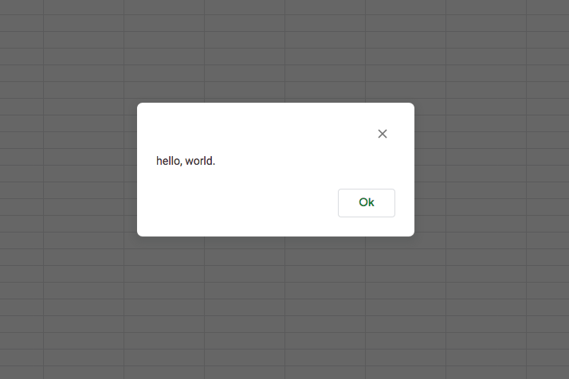

# The Google Apps Script onOpen() event

You'll normally want your custom form to appear when the user opens a spreadsheet.
That action triggers the 'onOpen()' function. Normally that's the place to build
a custom dialog but let's do the simplest possible thing. Everyone's first
program is always the same: `hello, world.`

 
* Click [Sheets](https://docs.google.com/spreadsheets/u/0/) link, and choose **Start a new spreadsheet**.

* Choose `Untitled spreadshee` and give it a new name, for example, the ever-creative `test`.

## Open the script editor

* From the spreadsheet's **Tools** menu, choose **Script Editor**.
The editor appears and you're already in a file named `Code.gs` with some sample code.
* Delete the existing code.
* Add to the `Code.gs` file an `onOpen()` function.
```js
/**
 * @OnlyCurrentDoc
 */
function onOpen() {
  SpreadsheetApp.getUi().alert('hello, world.')
}
```
* To save the file, press Ctrl+S (Command+S on Macintosh) or choose the **File** menu, then **Save**.

You're asked for a project name.

* When asked to edit the project name, enter anything for now, say `foo`.

To make sure the page reloads, it's best to close the spreadsheet document altogether, then reopen it

* Close the main spreadsheet tab, and the code editor will be dismissed.

* Return to the [Sheets page](https://docs.google.com/spreadsheets/u/0/) and choose the spreadsheet you just created.


